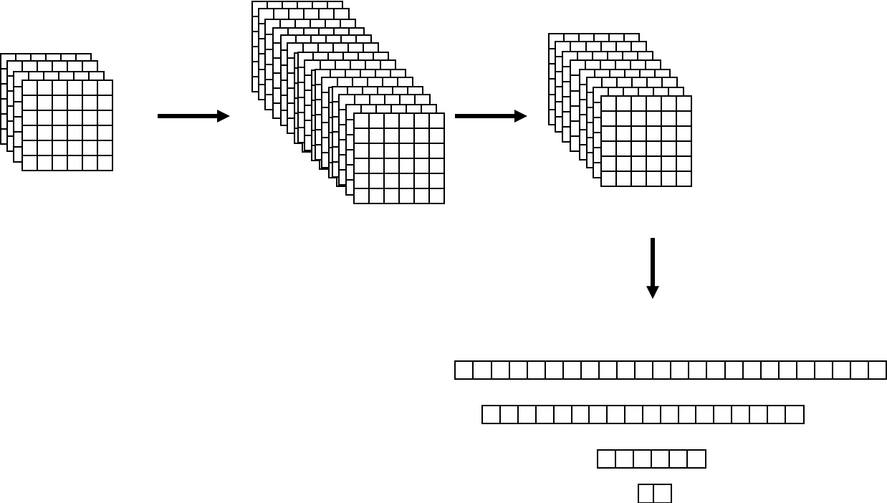

# Sensor Application example using Machine Learning ( Tf-Lite )


### 1. Model Summary


### 2. Model Compile for Arduino
1. you must extract decimal-hex data, 0x2bit, from the model.
```shell
cat tf-lite-model.tflite | xxd -i > hexdumps
```
2. The extracted hex values in `hexdumps` copy and paste to `model.h`
3. Ok. You can get the model just load importing header file `model.h`.

### 3. How to use Multi-dimensional values in arduino ?
since python with numpy or scikit-learn, many people did not consider to build matrix form from array.<br>
But cpp or c, that like low-level languages, is not easy for. However, you can think that how does you build multi-matrix using array in memory.<br>
It is basic idea which a multi factor matrix will be made sequential insert your data.<br>
