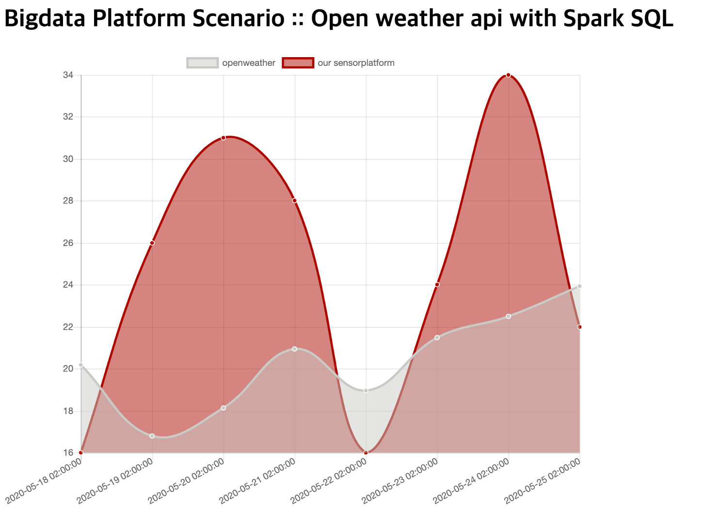

### Motivation
In this study, We tried to prediction for temperature as provide a recommendation clothes or a comparison weathers.<br>

### Contributed Method
We has been used for [OpenWeather API](https://openweathermap.org/api/one-call-api?gclid=Cj0KCQjwncT1BRDhARIsAOQF9LkhYESL982SZnl_RDaS5xNAtQpB-pbWhhc_rZCfQ-z1sY-oS-h5FmYaAgxeEALw_wcB#history), since using this api we can analysis and prediction data such temperature, pressure, or climate.<br>

### Usage OpenWeather API

You can test using the below code sample with curl.
```shell
curl 'https://api.openweathermap.org/data/2.5/onecall?lat={latitude}&lon={logitude}&exclude={Date}&appid={YourAPI}'
```
<br>
* `latitude and logitude` is a geometry location to get the climate data.
* `date` is a time. you can write one to three date-type such as current, hourly, and daily.
* `appid` is an API key of you. please let it get the key from [this](https://home.openweathermap.org/api_keys)
<br>
If you succeed for request, <br>
you will be received like the below json data.<br>

```json
{
    "lat": 60.99,
    "lon": 30.9,
    "timezone": "Europe/Moscow",
    "current": {
        "dt": 1588748620,
        "sunrise": 1588728835,
        "sunset": 1588788722,
        "temp": 278.68,
        "feels_like": 274.01,
        "pressure": 1009,
        "humidity": 77,
        "dew_point": 274.97,
        "uvi": 3.28,
        "clouds": 60,
        "wind_speed": 4.24,
        "wind_deg": 356,
        "weather": [
            {
                "id": 803,
                "main": "Clouds",
                "description": "broken clouds",
                "icon": "04d"
            }
        ]
    }
}
```

### Using Spark SQL
For our project, a temperature involved with variable other data in a climate, which is be represented form of JSON.<br>
It means the climate data uniformed at always.<br>
So we had decide to use `Spark SQL`, that is to support functional programming using MapReduce Processing.


### Visualization with django-chartjs
[Chartjs reference](https://embed.plnkr.co/plunk/z3Qy9C) <br>
**Demo Figure** <br>



### progress......
