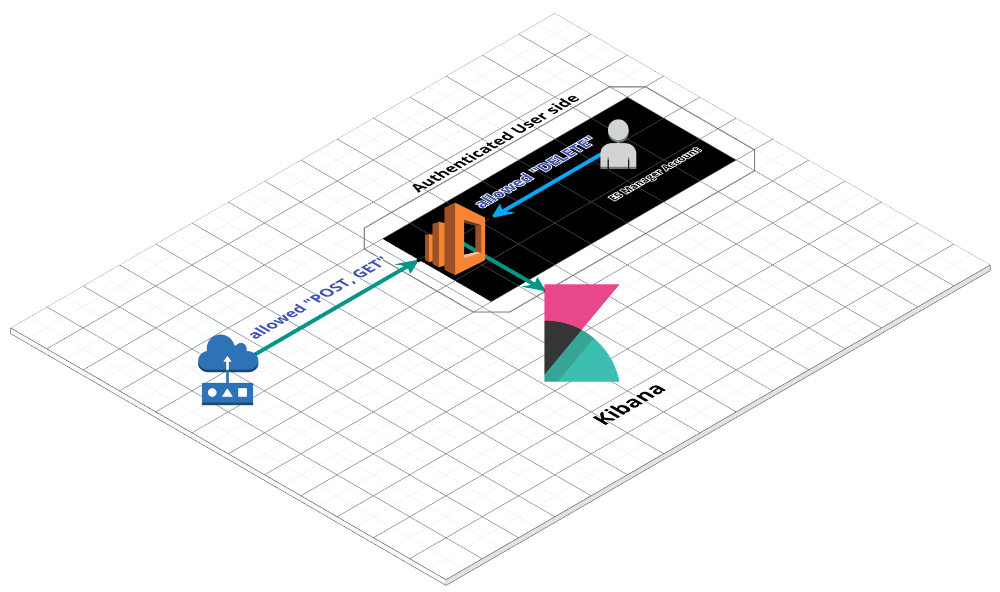

# Best Practice: IoT Environment with ElasticSearch Service on AWS

### Create Your ES Service
'''sh
aws es create-elasticsearch-domain --domain-name $ElasticSearch_Domain \
--elasticsearch-version $ES_VERSION --elasticsearch-cluster-config  InstanceType=$TYPE,InstanceCount=$PROVISIONING \
--ebs-options EBSEnabled=true,VolumeType=standard,VolumeSize=15 --access-policies '{json form}'
'''

you can start run using shell script 'setup_es.sh', however, you should set variables configuration values. 

### Access Policy
It's very important. 
if you want just to run test instance, you can init "Public Domain Access" which is opened external users.  
That is occurs security attack because non-authenticated whole user can modify your data. 
 
So i propose, the function of DELETE only access AWS Root account. 

### IoT examples
Arduino Nano 33 BLE Sense sample code 
[arduino.ino](./arduino_nano33_blesense.ino) 
send sensing data to ES 
[collect_send.py](./collect_send.py) 

### Architecture

